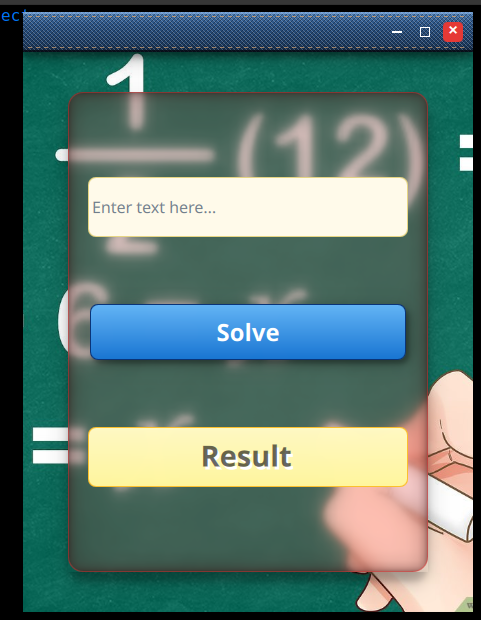
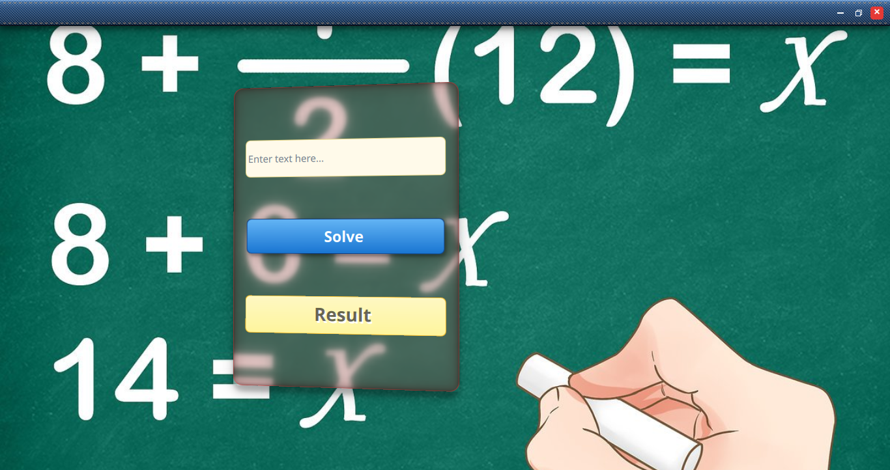
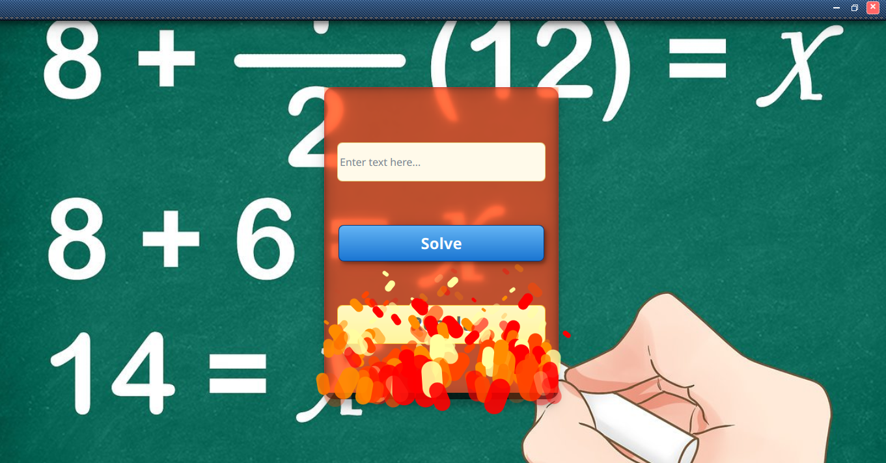
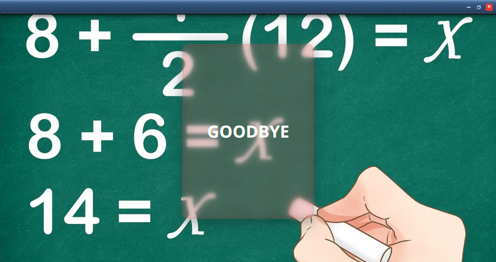

# QML & FastAPI Advanced GUI Project

An advanced desktop application integrating a modern User Interface built with **Qt Quick / QML** and **PySide6**, and a backend server powered by the **FastAPI** framework.

## 📸 Screenshots









## ✨ Features

* **Glassmorphism UI:** The interface relies heavily on realistic blur effects and edge shadows to create a transparent glass container.
* **3D Interaction:** Drag-and-drop glass container with 3D rotation and tilt effects based on mouse movement.
* **Custom Title Bar:** A programmatically designed title bar mimicking blue denim fabric texture with stitching details, featuring custom control buttons and double-click interaction to maximize/restore.
* **Particle System Animation:** Clicking the close button triggers an animation sequence integrating fire particles, fading the interface, and displaying a "Goodbye" screen before completely closing the application.
* **API Data Processing:** A PySide6-based Bridge system that sends user input to a FastAPI backend for processing (evaluating mathematical expressions) and retrieves the result to be displayed on the UI.

## ⚡ About Uvicorn & ASGI (The Backend Engine)

This project utilizes **Uvicorn** to run the FastAPI backend. Uvicorn is a high-performance **ASGI** web server. 

* **What is ASGI?** It stands for **Asynchronous Server Gateway Interface**. It is the modern standard interface between async-capable Python web servers, frameworks, and applications.
* **Why is it used here?** Unlike traditional synchronous servers (WSGI) that handle one request at a time sequentially, an ASGI server like Uvicorn allows the FastAPI application to handle multiple requests **asynchronously** and concurrently. This means non-blocking code execution, lightning-fast response times, and ensuring that the desktop UI remains incredibly smooth and responsive when communicating with the backend.

## 🛠️ Technologies Used

* **Frontend:** QML, Qt Quick (Controls, Layouts, Effects, Particles)
* **Bridge / Logic:** Python, PySide6, `requests` library
* **Backend:** Python, FastAPI
* **Server:** Uvicorn (ASGI)

## 🚀 How to Run

To ensure the application works correctly, start the backend server first, followed by the user interface.

### 1. Run the Backend Server (FastAPI)
Make sure the required packages are installed (`fastapi`, `uvicorn`), then run the server script:
```bash
python logic_server.py
```
*(Note: Uvicorn acts as the ASGI server under the hood, running the application on `127.0.0.1:8000`)*

### 2. Run the User Interface (GUI)
Ensure the required packages are installed (`PySide6`, `requests`), then run the main application file:
```bash
python main.py
```

## 📂 Project Structure

* `main.qml`: The main UI file, containing window settings, fire particles, and exit animations.
* `GuiV072.qml`: The design file containing the custom title bar, glass container, and blur effects.
* `bridge.py`: The QmlSingleton bridge connecting the UI and the server to send/receive data.
* `main.py`: The application entry point using PySide6.
* `logic_server.py`: The backend server that receives text and processes the mathematical expressions.
